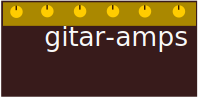

# GitAR-Amps - Git All Remotes Amplifiers



- [GitAR-Amps - Git All Remotes Amplifiers](#gitar-amps---git-all-remotes-amplifiers)
  - [Installation](#installation)
  - [List of amplifiers](#list-of-amplifiers)
    - [Comment LGTM on a merge request and approve it (optionally merge)](#comment-lgtm-on-a-merge-request-and-approve-it-optionally-merge)
    - [Open a merge request with --fetch origin --rebase origin/\<default\_upstream\_branch\>](#open-a-merge-request-with---fetch-origin---rebase-origindefault_upstream_branch)
    - [Gather all my `assigned` pull requests in a give state sorted by project](#gather-all-my-assigned-pull-requests-in-a-give-state-sorted-by-project)
    - [List all docker images in a Gitlab's project](#list-all-docker-images-in-a-gitlabs-project)
    - [List releases of a given Gitlab/Github repository sorted by version](#list-releases-of-a-given-gitlabgithub-repository-sorted-by-version)
  - [License](#license)

gitar amplifiers are a curated set of scripts that provide additional workflows
by combining gitar <https://github.com/jordilin/gitar> commands.

## Installation

Copy the directory `./bin/gitar` over to any directory in your `$PATH`. Let's
say `~/bin`, then (Using Linux OS as an example):

```bash
cp -r ./bin/gitar ~/bin
```

Adjust your `$PATH` to include `~/bin/gitar`:

```bash
export PATH=$PATH:~/bin/gitar
```

## List of amplifiers

### Comment LGTM on a merge request and approve it (optionally merge)

Comment "LGTM" on pull request timeline, approve it (Gitlab only) and
automatically merge it.

```bash
lgtm --merge 123
```

### Open a merge request with --fetch origin --rebase origin/<default_upstream_branch>

```bash
mr --title "New merge request"
```

### Gather all my `assigned` pull requests in a give state sorted by project

```bash
./mr-all-assigned-sort-by-project opened
```

### List all docker images in a Gitlab's project

Retrieve registry repository id in the current project where images are being stored.

```bash
gr dk list --repos
```

List all images in the registry repository with id 123.

```bash
./docker-list-images 123
```

### List releases of a given Gitlab/Github repository sorted by version

Outputs CSV with columns: `Tag,URL,Created_at`

```bash
./list-releases github.com/jordilin/gitar
```

Additionally, sort by date. Make use of datesorter command available at <https://github.com/jordilin/datesorter>

```bash
./list-releases github.com/jordilin/gitar | datesorter --column 2 --sort asc -
```

## License

This project is licensed under

- Source code: MIT license ([LICENSE](LICENSE) or
  [http://opensource.org/licenses/MIT](http://opensource.org/licenses/MIT))

- GitAR-Amps logo: [Creative Commons
Attribution-NonCommercial-ShareAlike 4.0 International (CC BY-NC-SA
4.0)](https://creativecommons.org/licenses/by-nc-sa/4.0/)
