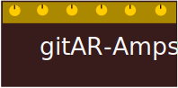

# GitAR-Amps - Git All Remotes Amplifiers

- [GitAR-Amps - Git All Remotes Amplifiers](#gitar-amps---git-all-remotes-amplifiers)
  - [License](#license)

gitar amplifiers are a curated set of scripts that provide additional workflows
by combining gitar <https://github.com/jordilin/gitar> commands.

## License

This project is licensed under

- Source code: MIT license ([LICENSE](LICENSE) or
  [http://opensource.org/licenses/MIT](http://opensource.org/licenses/MIT))

- GitAR-Amps logo: [Creative Commons
Attribution-NonCommercial-ShareAlike 4.0 International (CC BY-NC-SA
4.0)](https://creativecommons.org/licenses/by-nc-sa/4.0/)
